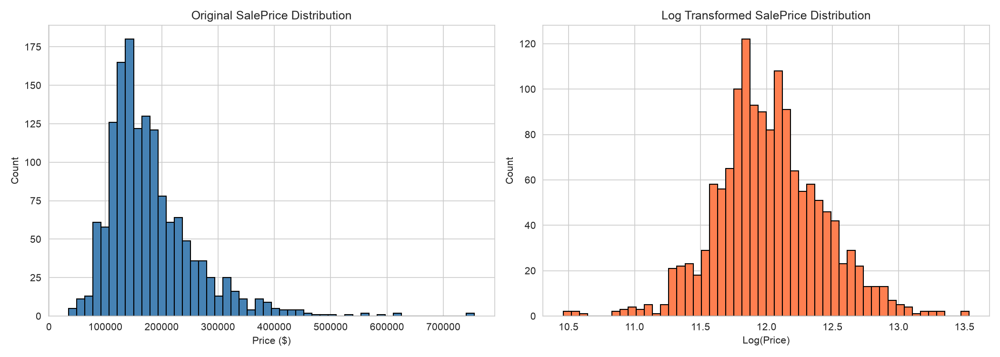
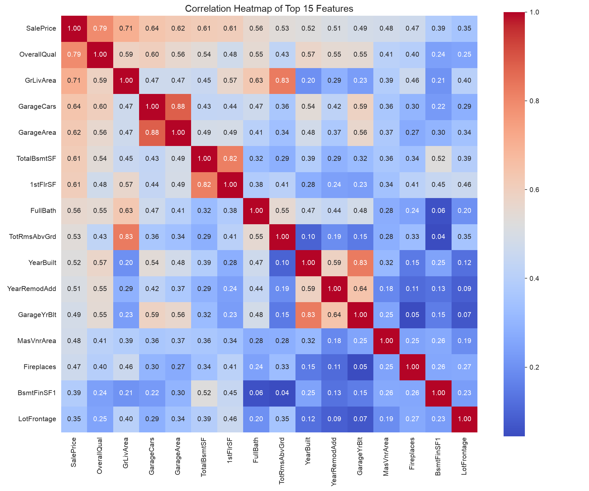
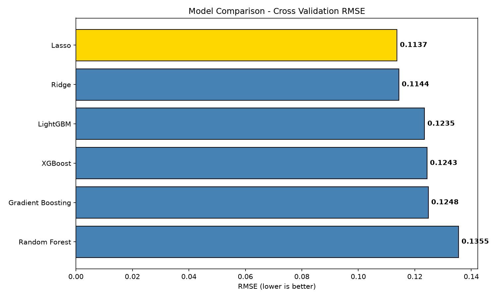
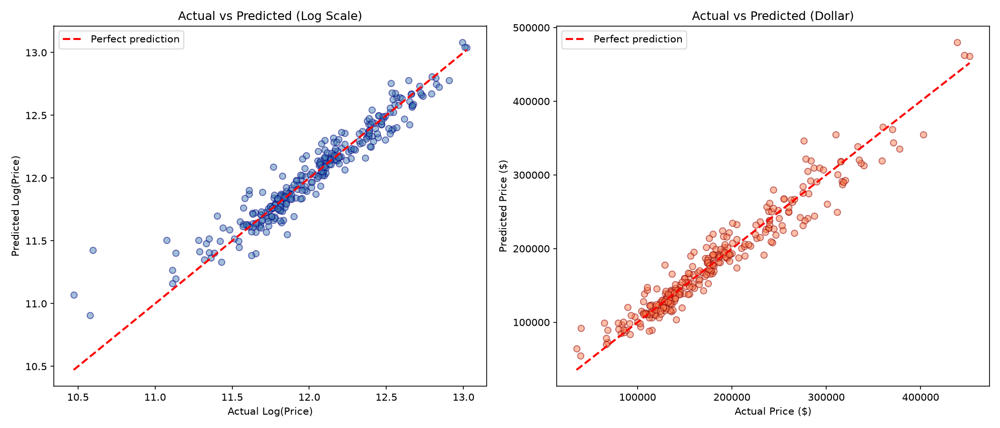
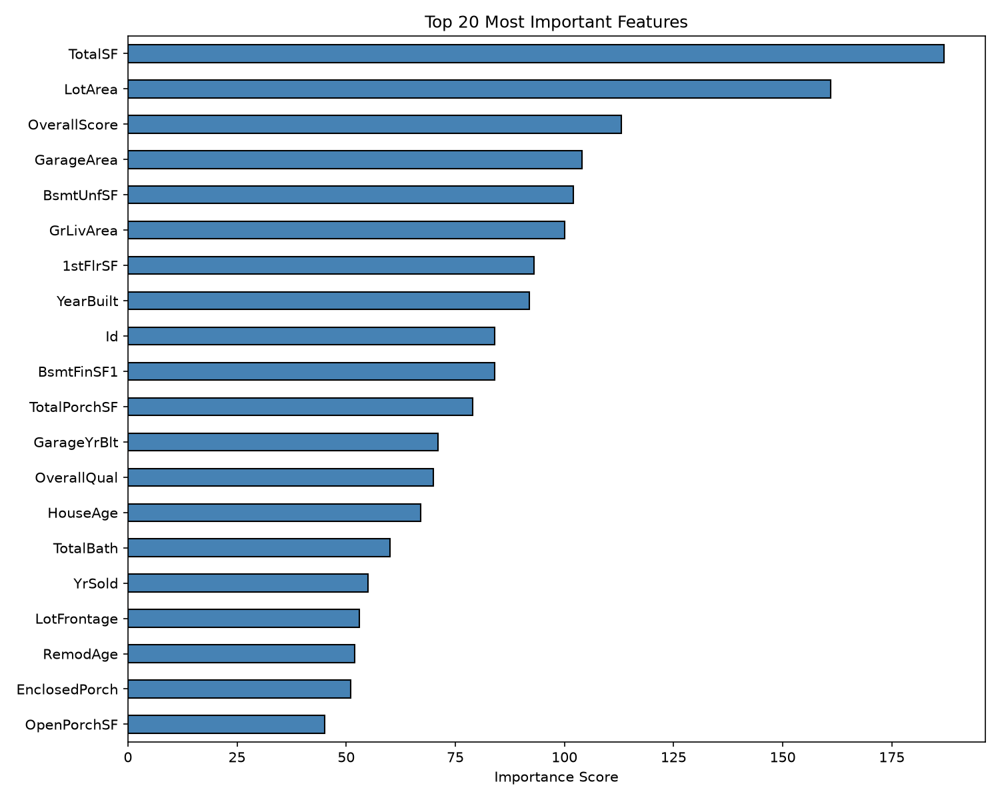

# 🏠 House Price Prediction

Predicting house sale prices using machine learning models with advanced feature engineering and stacking ensemble techniques.

> 📚 **Learning Project** — This project was built as a learning exercise to understand the end-to-end machine learning workflow, from EDA to model deployment. It was developed with AI assistance (Google Gemini) as a guided learning process.

---

## 📌 About

This project uses the [Kaggle House Prices](https://www.kaggle.com/c/house-prices-advanced-regression-techniques) dataset (79 features, 1460 samples) to predict residential home prices in Ames, Iowa.

### Key Highlights
- 📊 Comprehensive EDA with 10+ visualizations
- 🔧 11 custom-engineered features (TotalSF, HouseAge, OverallScore, etc.)
- 🤖 6 models compared: Ridge, Lasso, Random Forest, XGBoost, LightGBM, Stacking
- 🏆 Best model: **Stacking Ensemble** with **RMSE: 0.1126**

---

## 🛠️ Tech Stack

---

## 📁 Project Structure

    house-price-prediction/
    ├── README.md
    ├── requirements.txt
    ├── .gitignore
    ├── config/
    │   └── config.yaml
    ├── data/
    │   ├── raw/                  # Original dataset (not tracked)
    │   └── processed/            # Preprocessed data
    ├── notebooks/
    │   ├── 01_EDA.ipynb          # Exploratory Data Analysis
    │   ├── 02_feature_engineering.ipynb  # Preprocessing & Feature Engineering
    │   └── 03_modeling.ipynb     # Model training & evaluation
    ├── src/
    │   ├── __init__.py
    │   └── data_loader.py        # Data loading utilities
    ├── models/                   # Saved models
    └── reports/
        └── figures/              # Generated plots

---

## 📊 Results

### Model Comparison

| Model | CV RMSE | Rank |
|-------|:-------:|:----:|
| **Stacking Ensemble** | **0.1126** | 🥇 |
| Lasso | 0.1137 | 🥈 |
| Ridge | 0.1144 | 🥉 |
| LightGBM | 0.1235 | 4 |
| XGBoost | 0.1243 | 5 |
| Gradient Boosting | 0.1248 | 6 |
| Random Forest | 0.1355 | 7 |

### SalePrice Distribution

### Correlation Heatmap

### Model Comparison

### Actual vs Predicted

### Feature Importance

---

## 🔧 Feature Engineering

11 new features were created from domain knowledge:

| Feature | Formula | Impact |
|---------|---------|--------|
| TotalSF | TotalBsmtSF + 1stFlrSF + 2ndFlrSF | 🥇 Most important feature |
| OverallScore | OverallQual × OverallCond | 🥉 3rd most important |
| TotalBath | Full + Half×0.5 + Basement baths | Top 20 |
| HouseAge | YrSold - YearBuilt | Top 20 |
| TotalPorchSF | All porch areas combined | Top 20 |
| RemodAge | YrSold - YearRemodAdd | Top 20 |
| IsRemodeled | YearBuilt ≠ YearRemodAdd | Binary flag |
| HasPool / HasGarage / Has2ndFloor / HasFireplace | Binary existence flags | Binary flags |

---

## 🚀 Installation & Usage

1. Clone the repository:

        git clone https://github.com/ab5002-debug/House-Price-Prediction.git
        cd House-Price-Prediction

2. Create virtual environment:

        python3 -m venv venv
        source venv/bin/activate

3. Install dependencies:

        pip install -r requirements.txt

### Run Notebooks

Open notebooks in order:
1. `notebooks/01_EDA.ipynb` — Exploratory Data Analysis
2. `notebooks/02_feature_engineering.ipynb` — Preprocessing & Feature Engineering
3. `notebooks/03_modeling.ipynb` — Model Training & Evaluation

---

## 📝 Key Learnings

- **Feature Engineering > Model Selection**: Custom features (TotalSF, OverallScore) became the top predictors
- **Log Transform**: Essential for right-skewed target variables in regression
- **Stacking Ensemble**: Combining multiple models outperforms any single model
- **EDA is Critical**: Understanding data before modeling prevents costly mistakes
- **Cross-Validation**: More reliable than single train-test split

---

## 🔮 Future Improvements

- [ ] Hyperparameter tuning with Optuna
- [ ] Add more interaction features
- [ ] Try neural network (MLP) approach
- [ ] Build a web app with Streamlit for predictions
- [ ] Remove Id column from features

---

## 🤝 Acknowledgments

- Dataset: [Kaggle House Prices Competition](https://www.kaggle.com/c/house-prices-advanced-regression-techniques)
- Built with guidance from **Google Gemini AI** as a learning exercise
- Inspired by the data science community on Kaggle

---

## 📄 License

This project is open source and available under the [MIT License](LICENSE).
